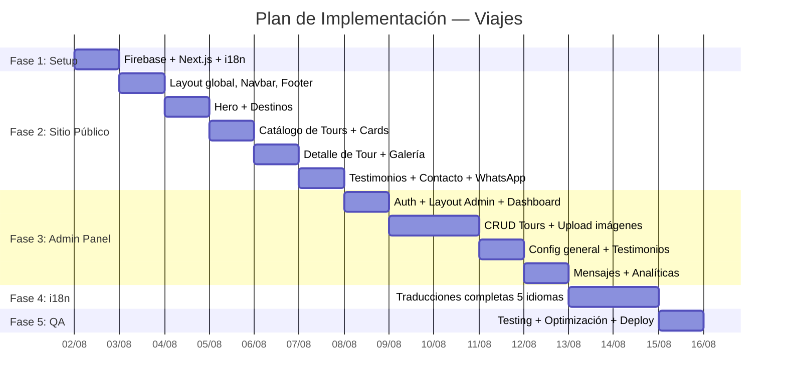

# 🌴 Plan de Implementación — VIAJES

## Resumen del Proyecto

| Campo | Valor |
|---|---|
| **Empresa** | Viajes |
| **WhatsApp** | +525551652314 |
| **Destinos** | Los Cabos, Cancún, Puerto Vallarta |
| **Idiomas** | Español, English, Français, Português, Deutsch |
| **Stack** | Next.js 14 + Firebase (Firestore, Auth, Storage) |
| **Hosting** | Vercel |

### Logo Propuesto


---

## ✅ Requerimientos Must-Be

### Funcionales — Sitio Público

| # | Must Be | Descripción |
|---|---|---|
| **MB-01** | **Multi-idioma completo** | El sitio debe soportar ES, EN, FR, PT, DE con selector visible en navbar. URLs localizadas (`/es/tours/...`, `/en/tours/...`). Contenido de tours traducible desde admin. |
| **MB-02** | **Catálogo de tours por destino** | Página con todos los tours, filtrable por destino (Cabos, Cancún, Vallarta). Cards con imagen, título, precio, duración y botón de WhatsApp. |
| **MB-03** | **Página de detalle de tour** | Cada tour tiene página propia con galería de imágenes, descripción completa, qué incluye/no incluye, precios, y CTA de WhatsApp con mensaje pre-armado. |
| **MB-04** | **WhatsApp click-to-chat en todo el sitio** | Botón flotante siempre visible + botón en cada tour. El mensaje se pre-arma con el nombre del tour y el idioma del usuario. Número configurable desde admin. |
| **MB-05** | **Diseño profesional estilo Moikka** | Diseño limpio: fondo blanco, cards con sombra suave, tipografía DM Sans, navegación clásica. Sin glassmorphism ni efectos trendy. Responsive mobile-first. |
| **MB-06** | **SEO optimizado por idioma** | Meta tags (title, description, OG, Twitter) en cada idioma. `hreflang` tags para indicar versiones alternativas a Google. Sitemap multi-idioma. |

### Funcionales — Panel de Administración

| # | Must Be | Descripción |
|---|---|---|
| **MB-07** | **Login protegido** | Acceso al panel solo con usuario autenticado (Firebase Auth). Credenciales iniciales configuradas en el setup. |
| **MB-08** | **CRUD completo de tours** | Crear, editar, listar, eliminar tours. Cada tour tiene campos traducibles (título, descripciones) para los 5 idiomas. Subida de múltiples imágenes. Estado publicado/borrador. |
| **MB-09** | **Configuración general editable** | Desde admin se puede cambiar: número de WhatsApp, email, teléfono, redes sociales, logo, imagen del hero, textos del hero (por idioma), colores primario/secundario. |
| **MB-10** | **Gestión de testimonios** | CRUD de testimonios con nombre, foto, destino, texto (por idioma), calificación. Mostrar/ocultar individualmente. |
| **MB-11** | **Bandeja de mensajes de contacto** | Ver todos los mensajes enviados desde el formulario público. Marcar como leído/respondido. |
| **MB-12** | **Analíticas de visitas y clics** | Dashboard con: visitas totales (hoy/semana/mes), clics en WhatsApp por tour, tours más vistos, gráfica de visitas últimos 30 días. |

### Técnicos

| # | Must Be | Descripción |
|---|---|---|
| **MB-13** | **Performance** | Lighthouse score ≥ 90 en Performance. Imágenes optimizadas con `next/image`. Lazy loading en carrusel e imágenes de tours. |
| **MB-14** | **Responsive** | Funcional y atractivo en móvil (320px), tablet (768px) y desktop (1200px+). Breakpoints probados. |
| **MB-15** | **Accesible** | Estructura semántica HTML5, alt text en imágenes, contraste de colores WCAG AA, navegación por teclado en menú y modales. |

---

## 🏗️ Fases de Implementación



---

### Fase 1: Setup del Proyecto (Día 1)

| Tarea | Detalle |
|---|---|
| Crear proyecto Next.js 14 | `npx -y create-next-app@latest ./` con App Router |
| Configurar Firebase | Crear proyecto, habilitar Firestore, Auth, Storage |
| Instalar dependencias | `firebase`, `next-intl` para i18n |
| Estructura de carpetas | `/app/[locale]/...` para routing multi-idioma |
| Configurar i18n | `next-intl` con archivos de traducción JSON por idioma |
| Seed de datos demo | Poblar Firestore con 9 tours demo (3 por destino) |
| Variables de entorno | `.env.local` con credenciales Firebase |

---

### Fase 2: Sitio Público (Días 2-6)

#### 2A. Layout Global + Navbar + Footer
- **Navbar**: Logo · Inicio · Destinos · Tours · Nosotros · Contacto · 🌐 Selector de idioma · [CTA WhatsApp]
- **Footer**: 4 columnas (Info, Links, Destinos, Contacto) + redes sociales
- **WhatsApp flotante**: Botón fijo esquina inferior derecha
- Datos dinámicos desde Firestore (`config/general`)

#### 2B. Hero + Destinos
- Hero: imagen de fondo (desde admin), overlay, título/subtítulo (traducidos), 2 botones
- Destinos: 3 cards con imagen, nombre, conteo de tours, link

#### 2C. Catálogo de Tours
- Tabs por destino (Todos | Cabos | Cancún | Vallarta)
- Grid responsive de TourCards
- Datos desde Firestore (solo `status: "published"`)
- Botón WhatsApp por card con mensaje localizado

#### 2D. Detalle de Tour
- Ruta: `/[locale]/tours/[slug]`
- Galería, descripción, incluye/no incluye, precios
- Botón WhatsApp grande con mensaje contextual
- Tours relacionados del mismo destino

#### 2E. Testimonios + Contacto + WhatsApp
- Carrusel de testimonios (datos de Firestore)
- Formulario de contacto → guarda en Firestore
- Integración WhatsApp con mensajes por idioma

---

### Fase 3: Panel Admin (Días 7-10)

#### 3A. Auth + Layout + Dashboard
- Página de login con Firebase Auth (email/password)
- Layout admin: sidebar con navegación, header con usuario
- Dashboard: cards de resumen (visitas, clics, tours, mensajes)

#### 3B. CRUD Tours
- **Lista**: tabla con columnas (título, destino, estado, acciones)
- **Formulario** crear/editar:
  - Tabs por idioma para campos traducibles (título, descripción breve, descripción completa, incluye, no incluye)
  - Select de destino
  - Upload de imágenes (múltiples, drag & drop) → Firebase Storage
  - Campos: duración, capacidad, precios
  - Toggle publicado/borrador
- **Eliminar**: soft delete con papelera

#### 3C. Config General + Testimonios
- Formulario de configuración con todos los campos editables
- Preview de colores en tiempo real
- CRUD testimonios con campos por idioma

#### 3D. Mensajes + Analíticas
- Tabla de mensajes con filtro leído/no leído
- Dashboard analíticas: gráfica Chart.js de visitas, ranking de tours

---

### Fase 4: Internacionalización (Días 11-12)

#### Estrategia i18n con `next-intl`

**Routing**: `app/[locale]/page.js` — el locale se extrae de la URL

```
/es/          → Home en español
/en/          → Home en inglés
/fr/tours/... → Tours en francés
/pt/tours/... → Tours en portugués
/de/tours/... → Tours en alemán
```

**Archivos de traducción** (textos estáticos de la UI):

```
messages/
├── es.json    ← Español (default)
├── en.json    ← English
├── fr.json    ← Français
├── pt.json    ← Português
└── de.json    ← Deutsch
```

**Ejemplo de `es.json`:**
```json
{
  "nav": {
    "home": "Inicio",
    "destinations": "Destinos",
    "tours": "Tours",
    "about": "Nosotros",
    "contact": "Contacto"
  },
  "hero": {
    "cta_explore": "Explorar Tours",
    "cta_whatsapp": "Hablar con un asesor"
  },
  "tours": {
    "duration": "Duración",
    "capacity": "Hasta {max} personas",
    "price_from": "Desde",
    "per_person": "por persona",
    "book_whatsapp": "Reservar por WhatsApp",
    "view_details": "Ver detalles",
    "includes": "Qué incluye",
    "excludes": "No incluye",
    "related": "Tours relacionados",
    "filter_all": "Todos",
    "whatsapp_message": "Hola, me interesa el tour \"{tour}\" en {destination}. ¿Me pueden dar más información?"
  },
  "destinations": {
    "cabos": "Los Cabos",
    "cancun": "Cancún",
    "vallarta": "Puerto Vallarta",
    "tours_available": "{count} tours disponibles"
  },
  "contact": {
    "title": "Contáctanos",
    "name": "Nombre",
    "email": "Correo electrónico",
    "destination": "Destino de interés",
    "message": "Mensaje",
    "send": "Enviar mensaje"
  },
  "footer": {
    "rights": "Todos los derechos reservados"
  }
}
```

**Contenido dinámico (tours, testimonios, hero)** — campos traducidos en Firestore:

```javascript
// Documento de tour en Firestore
{
  slug: "snorkel-chileno-bay",
  destination: "cabos",
  title: {
    es: "Snorkel en Chileno Bay",
    en: "Snorkeling at Chileno Bay",
    fr: "Plongée à Chileno Bay",
    pt: "Snorkel em Chileno Bay",
    de: "Schnorcheln in Chileno Bay"
  },
  shortDescription: {
    es: "Explora los arrecifes...",
    en: "Explore the reefs...",
    fr: "Explorez les récifs...",
    pt: "Explore os recifes...",
    de: "Erkunden Sie die Riffe..."
  },
  // ... otros campos traducibles igual
  // Campos no traducibles (iguales en todos los idiomas):
  duration: "4 horas",
  maxCapacity: 8,
  priceAdult: 1200,
  images: ["url1", "url2"]
}
```

---

### Fase 5: QA y Deploy (Día 13)

- Build de producción sin errores
- Test en móvil, tablet, desktop
- Verificar todos los idiomas
- Lighthouse ≥ 90
- Deploy a Vercel
- Configurar dominio personalizado

---

## 🗄️ Modelo de Datos Firestore (Completo)

```
firestore/
│
├── tours/{tourId}
│   ├── slug: string
│   ├── destination: "cabos" | "cancun" | "vallarta"
│   ├── title: { es, en, fr, pt, de }
│   ├── shortDescription: { es, en, fr, pt, de }
│   ├── fullDescription: { es, en, fr, pt, de }
│   ├── includes: { es: string[], en: string[], ... }
│   ├── excludes: { es: string[], en: string[], ... }
│   ├── images: string[]
│   ├── duration: string
│   ├── maxCapacity: number
│   ├── priceAdult: number
│   ├── priceChild: number
│   ├── priceGroup: number
│   ├── status: "published" | "draft"
│   ├── order: number
│   ├── viewCount: number
│   ├── whatsappClicks: number
│   ├── createdAt: timestamp
│   └── updatedAt: timestamp
│
├── testimonials/{id}
│   ├── name: string
│   ├── photo: string
│   ├── destination: string
│   ├── text: { es, en, fr, pt, de }
│   ├── rating: number
│   ├── visible: boolean
│   └── createdAt: timestamp
│
├── contacts/{id}
│   ├── name: string
│   ├── email: string
│   ├── destination: string
│   ├── message: string
│   ├── locale: string
│   ├── read: boolean
│   └── createdAt: timestamp
│
├── analytics/events/{id}
│   ├── type: "page_view" | "whatsapp_click"
│   ├── page: string
│   ├── tourId: string | null
│   ├── locale: string
│   ├── timestamp: timestamp
│   └── userAgent: string
│
└── config/general (documento único)
    ├── companyName: string
    ├── logo: string
    ├── whatsappNumber: string ("+525551652314")
    ├── email: string
    ├── phone: string
    ├── socialMedia: { instagram, facebook, tiktok }
    ├── heroImage: string
    ├── heroTitle: { es, en, fr, pt, de }
    ├── heroSubtitle: { es, en, fr, pt, de }
    ├── aboutText: { es, en, fr, pt, de }
    ├── primaryColor: string ("#1B5E3B")
    └── secondaryColor: string ("#D4A853")
```

---

## 📁 Estructura de Archivos

```
viajes/
├── app/
│   ├── [locale]/
│   │   ├── layout.js                  ← Layout con Navbar, Footer, WA button
│   │   ├── page.js                    ← Home
│   │   ├── tours/
│   │   │   ├── page.js                ← Catálogo de tours
│   │   │   └── [slug]/
│   │   │       └── page.js            ← Detalle de tour
│   │   ├── nosotros/
│   │   │   └── page.js                ← Sobre nosotros
│   │   └── contacto/
│   │       └── page.js                ← Contacto
│   ├── admin/
│   │   ├── layout.js                  ← Layout admin (sidebar, auth)
│   │   ├── page.js                    ← Dashboard
│   │   ├── login/page.js              ← Login
│   │   ├── tours/
│   │   │   ├── page.js                ← Lista
│   │   │   ├── nuevo/page.js          ← Crear
│   │   │   └── [id]/page.js           ← Editar
│   │   ├── testimonios/page.js        ← CRUD testimonios
│   │   ├── configuracion/page.js      ← Config general
│   │   ├── mensajes/page.js           ← Bandeja
│   │   └── analiticas/page.js         ← Dashboard analíticas
│   └── api/
│       ├── contact/route.js
│       └── analytics/route.js
│
├── components/
│   ├── public/
│   │   ├── Navbar.js + Navbar.module.css
│   │   ├── Footer.js + Footer.module.css
│   │   ├── WhatsAppButton.js
│   │   ├── Hero.js + Hero.module.css
│   │   ├── DestinationCard.js
│   │   ├── TourCard.js + TourCard.module.css
│   │   ├── TourGallery.js
│   │   ├── TestimonialCarousel.js
│   │   ├── ContactForm.js
│   │   └── LanguageSelector.js
│   └── admin/
│       ├── Sidebar.js
│       ├── TourForm.js
│       ├── StatsCard.js
│       ├── VisitsChart.js
│       ├── ImageUploader.js
│       └── TranslationTabs.js
│
├── lib/
│   ├── firebase.js                     ← Firebase config
│   ├── firestore.js                    ← CRUD helpers
│   ├── storage.js                      ← Upload helpers
│   ├── analytics.js                    ← Tracking
│   └── whatsapp.js                     ← URL generator
│
├── messages/
│   ├── es.json
│   ├── en.json
│   ├── fr.json
│   ├── pt.json
│   └── de.json
│
├── styles/
│   ├── globals.css                     ← Variables, reset, tipografía
│   ├── admin.module.css                ← Estilos del panel
│   └── ...module.css                   ← Por componente
│
├── i18n/
│   ├── config.js                       ← Locales soportados, default
│   └── request.js                      ← next-intl request config
│
├── middleware.js                        ← Redirect a locale default
├── next.config.js                       ← Config con next-intl plugin
├── .env.local                           ← Firebase keys
├── package.json
└── public/
    ├── logo.png
    └── images/
```

---

## 🔥 Setup de Firebase (Paso a Paso)

Como no hay proyecto Firebase aún, lo crearemos desde cero:

1. **Crear proyecto** en [console.firebase.google.com](https://console.firebase.google.com)
2. **Habilitar Firestore** (modo producción, región `us-central1`)
3. **Habilitar Authentication** → método Email/Password
4. **Crear usuario admin** manualmente desde la consola de Auth
5. **Habilitar Storage** → crear bucket default
6. **Copiar credenciales** del proyecto (apiKey, authDomain, etc.) al `.env.local`
7. **Configurar Security Rules** de Firestore:
   - Lectura pública para `tours`, `testimonials`, `config`
   - Escritura solo autenticados para todo
   - Lectura autenticada para `contacts`, `analytics`

---

## ✅ Plan de Verificación

### Build
- [ ] `npm run build` sin errores ni warnings
- [ ] `npm run dev` funciona correctamente

### Sitio Público (por cada idioma)
- [ ] Navbar muestra links correctos, selector de idioma funciona
- [ ] Hero carga imagen y textos del idioma seleccionado
- [ ] Destinos muestran conteo correcto de tours
- [ ] Tabs de tours filtran por destino
- [ ] Cards muestran datos traducidos al idioma actual
- [ ] Botón WhatsApp genera mensaje en el idioma correcto
- [ ] Detalle de tour muestra galería, descripciones, precios
- [ ] Testimonios cargan y muestran texto en idioma actual
- [ ] Formulario de contacto guarda en Firestore
- [ ] Botón flotante de WhatsApp siempre visible
- [ ] Meta tags SEO correctos por idioma + hreflang
- [ ] Responsive: móvil 320px, tablet 768px, desktop 1200px+
- [ ] Lighthouse Performance ≥ 90

### Panel Admin
- [ ] Login redirige a dashboard, logout funciona
- [ ] Dashboard muestra estadísticas reales
- [ ] Crear tour con traducciones en 5 idiomas
- [ ] Subir múltiples imágenes a Storage
- [ ] Editar tour existente, cambiar estado
- [ ] Eliminar tour (soft delete)
- [ ] Config: cambiar WhatsApp, logo, colores → se refleja en sitio público
- [ ] CRUD testimonios funcional
- [ ] Mensajes: lista con leído/no leído
- [ ] Analíticas: gráfica de visitas, ranking de tours
